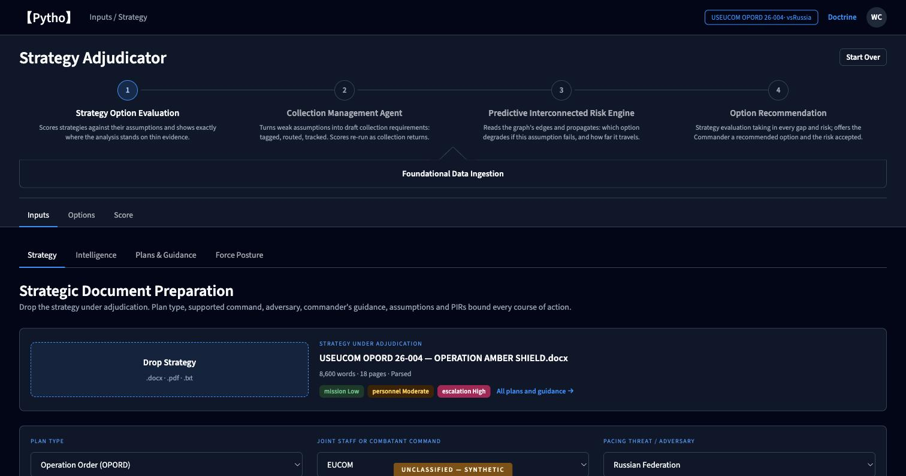
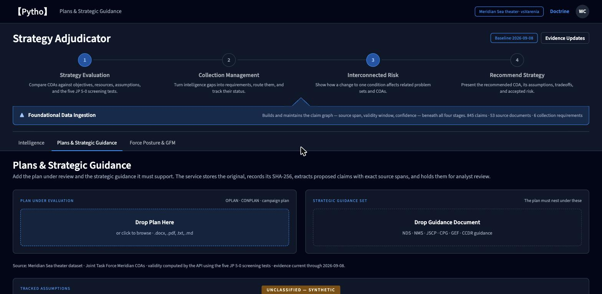
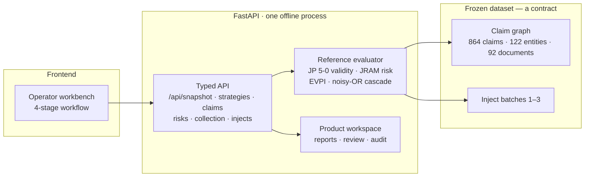

<div align="center">

# Strategy Adjudicator

**Course-of-action evaluation that shows its work — every score traced to a sourced claim, an exact span, and a doctrinal test.**

Built for the J2 hackathon by **Pytho**. UI shell: *Stratistics Wargaming System*.

[**Live demo → http://54.90.137.38:9010/**](http://54.90.137.38:9010/) · [Dataset-backed workbench](http://54.90.137.38:9010/wired/) · [API](http://54.90.137.38:9010/api/meta)

`313 tests` · `29 dataset gates` · `20 doctrinal invariants` · `byte-identical regeneration` · `offline, no model key`

</div>

---



## The problem

A planner comparing courses of action has to answer three questions under time pressure: **which option is best, why, and what new information would change the answer.** Today that reasoning lives in slides and in people's heads. When an assumption turns out to be wrong, nothing recomputes, and nobody can trace the recommendation back to the reporting that produced it.

## What this does

Four connected capabilities over one claim graph:

| Stage | What it does |
|---|---|
| **1 · Strategy Option Evaluation** | Scores each COA against its assumptions and the five JP 5-0 validity tests, and shows exactly where the analysis rests on thin evidence. |
| **2 · Collection Management** | Turns decision-relevant gaps into draft requirements — tagged, routed, tracked — priced by the expected value of the information. |
| **3 · Predictive Interconnected Risk** | Propagates a change along the graph's edges: which option degrades if this assumption fails, and how far the effect travels. |
| **4 · Option Recommendation** | Presents the recommended COA with its assumptions, tradeoffs, and the risk being accepted. |

Beneath all four: **foundational data ingestion** maintains the sourced claim graph — source span, validity window, confidence — that everything else reads.

## Why the engineering is interesting

**Nothing on screen is typed in.** Every value is recomputed by a reference evaluator from the claim graph. The API refuses to serve a number it cannot derive.

**Provenance reaches the exact character.** Any claim returns the sentence that produced it, with both time axes kept separate:

```json
{ "claim_id": "clm_0001",
  "span_text": "Dorne-3 is operated by the coastal missile brigade.",
  "asserted_at": "2026-09-05",   "valid_from": "2026-03-12",  "valid_to": null,
  "likelihood_icd203": null, "confidence_icd203": "high", "confidence": 0.97,
  "status": "approved" }
```

**Doctrine is implemented, not name-dropped.** 168 verbatim extracts from CJCSM 3105.01C (JRAM), JP 5-0, CJCSI 3100.01F, JP 2-01 and JP 3-60 are machine-checked against the source PDFs on every run. The JRAM risk contour, the ICD 203 → JRAM crosswalk with its forced-choice rule, the JP 5-0 App. F comparison and its caution sentence are code paths with tests, each citing its figure.

**Uncertainty is modelled honestly.** Options are evaluated over 64 assumption worlds; `value_ci` is the min/max across adversary courses of action and is labelled an adversary-scenario range, never a confidence interval. Likelihood and confidence are never merged into one number.

**Change propagates and is explained.** Three timed inject batches move the world. An assumption flips, an option fails its *acceptable* gate, the ranking changes, a risk cascades across problem sets, and a collection requirement closes — each with a before/after diff computed from the graph, not scripted.

**It is reproducible.** `python -m gen --seed 20260908` regenerates the entire dataset byte-for-byte, verified in CI-style gates along with 20 invariants covering referential integrity, span validity, non-overlapping valid time, DAG acyclicity, and recomputation of every derived column to 1e-9.


<div align="center"><sub>The same workflow at <code>/wired</code>, every field served by the API from the claim graph.</sub></div>

## Architecture



The dataset is frozen and versioned by the SHA-256 of its archive; the API embeds that identity in its cache key, so a snapshot can never be served from stale data.

## Run it

```sh
make app-run        # http://127.0.0.1:8765/ — UI and API, one process, no network
make image && make image-run   # or in a container
```

Deploy to a host: `HOST=user@box ./deploy/deploy-ec2.sh` (see [docs/DEPLOY.md](docs/DEPLOY.md); it refuses to take a port another service uses and verifies no pre-existing container stopped).

## Verify the claims in this README

```sh
make check        # 29 dataset gates: 20 invariants, byte-identical regeneration, denylist
make test         # 35 dataset tests
make app-test     # 278 backend contract tests + browser tests
```

## Repository

| Path | Contents |
|---|---|
| `app/backend/` | FastAPI service: read API, ingestion, review, collection workflow, product state |
| `app/ui/` | Operator workbench (recovered from the design artifact; see `RECOVERY.md`) |
| `dataset/` | Frozen claim graph, schemas as contracts, reference evaluator, generator, inject batches |
| `dataset/doctrine/EXTRACTS.md` | 168 verbatim doctrine extracts, machine-verified against the PDFs |
| `docs/` | [State](docs/STATE.md) · [Capability matrix](docs/CAPABILITY_MATRIX.md) · [Demo](docs/DEMO.md) · [Deploy](docs/DEPLOY.md) · independent [reviews](docs/reviews) |

## What is real, and what is not

We would rather be checked than believed, so the boundaries are written down:

- **The scenario is fictional and synthetic**, marked `UNCLASSIFIED — SYNTHETIC` on every screen and in every generated product. The dataset's theater, actors, units and systems are invented; a denylist gate keeps real nations, alliances and weapon designators out of it.
- **The evaluation is a finite decision model, not a prediction of combat.** Expected value is a scenario-relative decision-support output.
- **The demo shell and the dataset-backed workbench are different scenarios.** `/` runs the design shell with its own demo content; [`/wired`](http://54.90.137.38:9010/wired/) is the same workflow driven entirely by the dataset and the evaluator. Aligning them is the current work.
- **Every unmet claim is tracked in the open** in [docs/CAPABILITY_MATRIX.md](docs/CAPABILITY_MATRIX.md), including dynamic wargaming and adversary-model source grounding, with the evidence for each row.

## License

Code and dataset released under CC BY 4.0. See [LICENSE](LICENSE).
